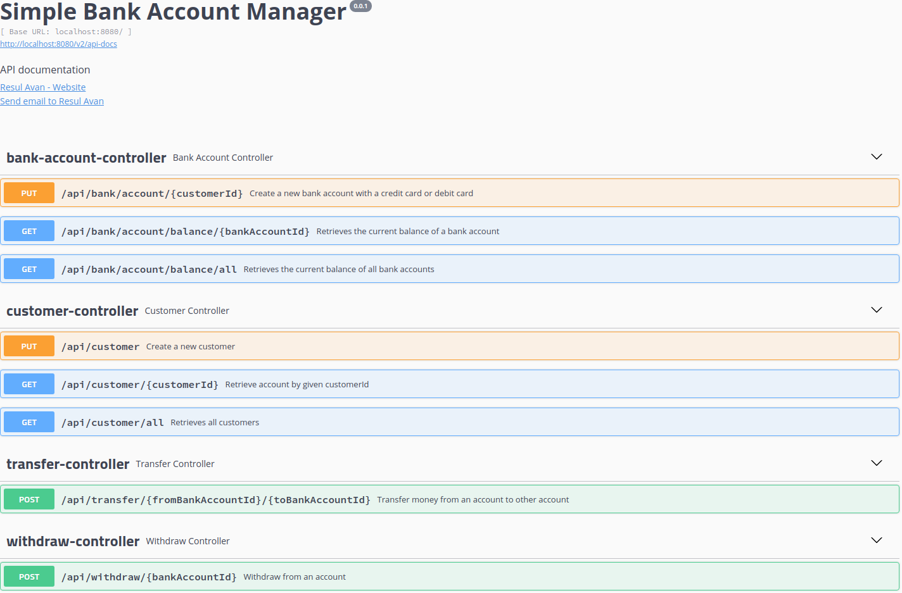

# bank-account-manager

This application is a simple bank account implementation. An account able to withdraw money and transfer money to another account.
The transfer can be with debit card or credit card. If a credit card is used, extra %1 transaction fee is charged. An account can linked with a credit card or bank account.

## implementation

- It should be possible to transfer and withdraw money from an account. It is possible to pay
  with either debit card or credit card. If a transfer/withdraw is done with a credit card, 1% of the amount is charged extra. Use design patterns where
  applicable and write some test cases as well.
    - `TransferControllerIT` and `WithdrawControllerIT` is creted to test the requirement. And also `fee` `amount` `totalAmount` `beforeBalance` `afterBalance` fields are visible to see the amount changes by a transaction  in `transaction_history` 
- A negative balance is not possible
    - `InsufficientBalanceException` created to manage neagtive of possible negative balances
- Account should contain at least some user details, card details and current balance
    - All models are placed in `com.rabobank.bankaccountmanager.domain` package
- One rest endpoint to see current available balance in all accounts
    - `BankAccountController.getAllBalances` and `BankAccountController.getBalance`
- One rest endpoint to withdraw money
    - `WithdrawController.withdraw`
- One rest endpoint to transfer money
    - `TransferController.withdraw`
- One credit card or debit card is linked with one account
    - See the `@OneToOne` relation on database
- It should be able to audit transfers or withdrawals
    - `updatedAt` and `createdAt` fields placed in all tables. Also `transaction_history` table is created to keep all changes.

### prerequisites
- JDK1.8
- gradle
- docker

### stacks
- Spring Boot
- Hibernate/JPA
- Postgresql
- Lombok
- Flyway
- Swagger
- pojo-tester

### endpoints

find all endpoint details: [api-docs](http://localhost:8080/swagger-ui.html) after running application

### tests

The unit and integration test package is same. The name of the unit test classes ends with `Test`; The name of the integration test class ends with 'IT'.

`89` test cases are created to test all cases.

Run the command to run all tests:

    gradle test

- Line coverage: `%99` (`406/410`)
- Case coverage: `%100`

#### unit tests

`pojo-tester` is used to automate model/dto tests. All related tests under `domain` package.

    testImplementation 'pl.pojo:pojo-tester:0.7.6'

#### integration tests

testcontainers and postgresql docker is used in integration test. First of all, it is creating a docker container environment to execute integration tests. That's why, It waits at the beginning.

        testImplementation 'org.testcontainers:testcontainers:1.11.4'
        testImplementation 'org.testcontainers:postgresql:1.11.4'

All integration tests run with `integration` spring profile. The profile inserts test data to database.

## build
    gradle clean build

## run on docker

to build:

    docker-compose build
 
to run; 
    
    docker-compose up -d
    
to stop:

    docker-compose down
    